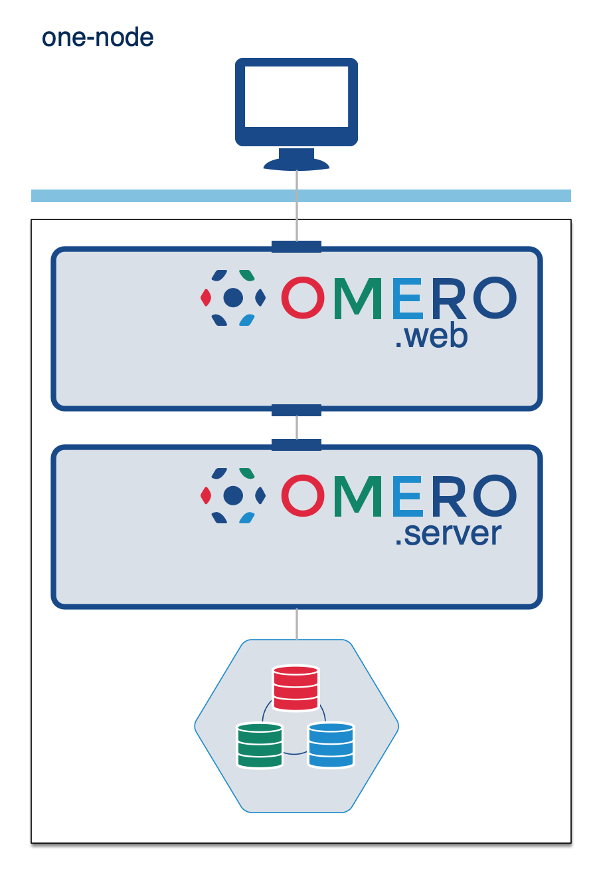
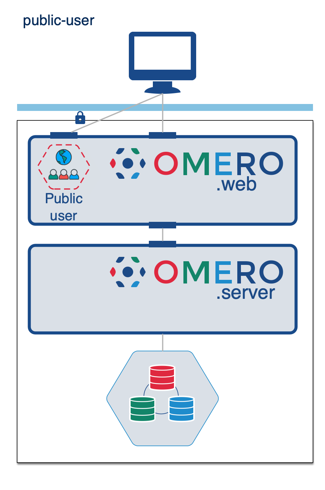
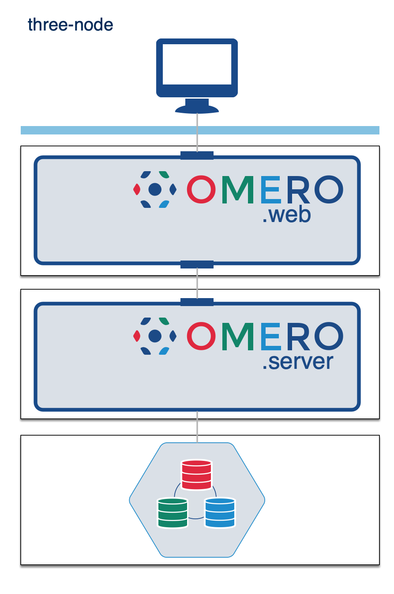

OMERO server examples
=====================

This repository contains example playbooks for installing OMERO with [Ansible](https://www.ansible.com/).
You can copy these and modify them for your own use.

Quick start
===========

- Install `ansible`: e.g. `pip install ansible`
- Install roles: `ansible-galaxy install -r requirements.yml -p roles`
- Install OMERO.server and OMERO.web using one of these playbooks:

Basics
------

The above diagram represents the most basic OMERO installation with OMERO.web, OMERO.server, and
PostgreSQL all installed on the same physical node. This repository includes ansible and docker
installation blueprints for this configuration as well as more advanced ones:

 * [Public user](#public-user): allow public access to selected data without the need to log in
 * [Three nodes](#three-nodes): use more physical or virtual hardware to scale up your installation

Public user
-----------

This recreates the configuration documented under https://docs.openmicroscopy.org/latest/omero/sysadmins/public.html

- `cd public-user; ansible-playbook playbook.yml`

Three nodes
-----------

This is an example of installing PostgreSQL, OMERO.server and OMERO.web on separate nodes.

- `cd three-nodes; ansible-playbook playbook.yml`

